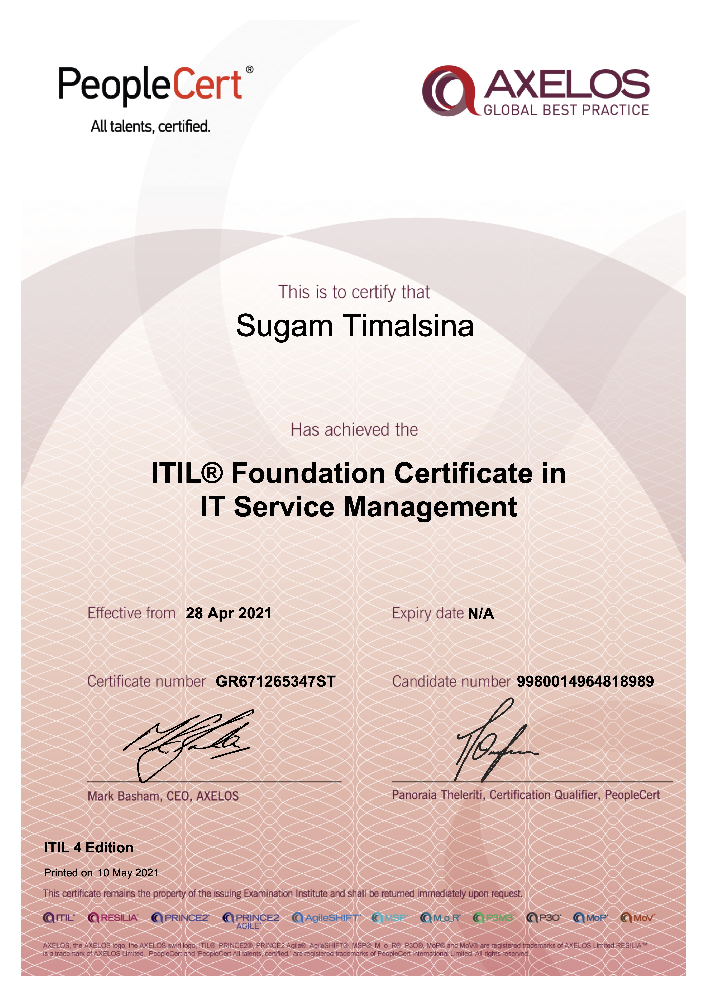
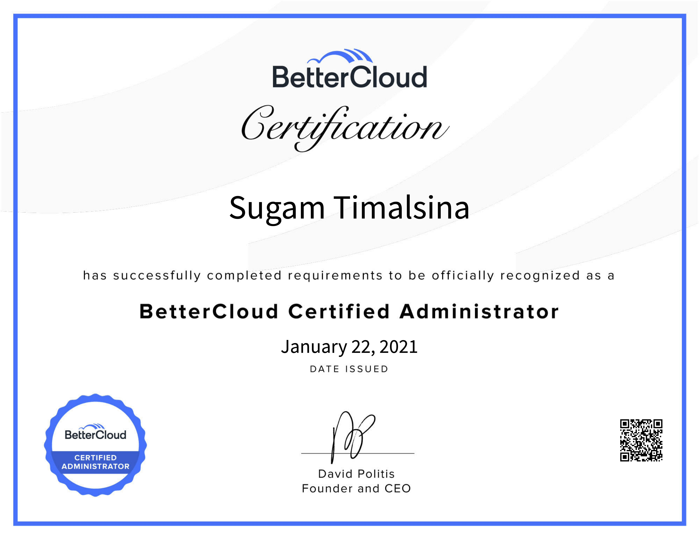
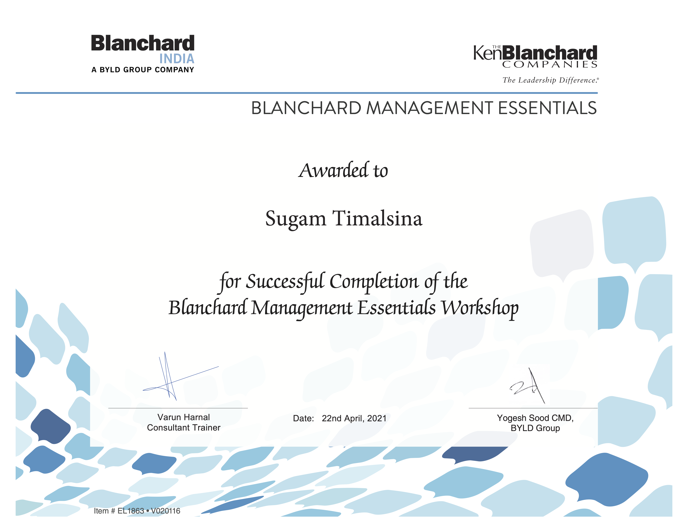
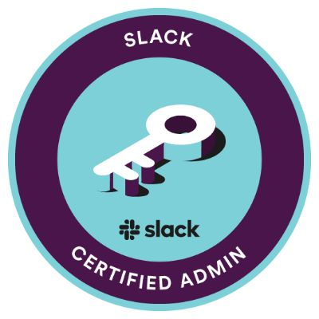

# I'm Sugam, a full-time full-stack Software Engineer 👨‍💻 working since 2018 🚀  
</h3>

- 🔭 I’m currently working on [CLOUDFACTORY](https://cloudfactory.com), An AI Company helping companies train their AI/ML.
- 🌱 I’m currently learning Go and Next.js
- 🗣 I speak English, Hindi, and Nepali.
- 📫 How to reach me: [LinkedIn](https://www.linkedin.com/in/sugam-timalsina-900152164/)

## Tech Stacks
### 📋 Language/Framework
  ¤
  ¤
  ¤
   ¤
 

 ### AWS
 ¤
 ¤
 ¤
 ¤
 ¤

### 💾 Database
 ¤
 ¤
 ¤
¤

### Devops
¤
 ¤
¤

## ITSM Certification
Please go through my LinkedIn to understand my domain knowledge and related work experiences regarding ITSM roles.

1. ITIL® Foundation Certificate in IT Service Management 

2. BetterCloud Certified Administrator 

3. KenBlanchard Management Essentials

4. Slack Certified Administrator 

Saas Tools
- Solarwinds Service Desk
- ZenDesk
- Sophos
- Google Workspace
- Slack
- BetterCloud
- Zapier
- ClickUp
- Cisco
